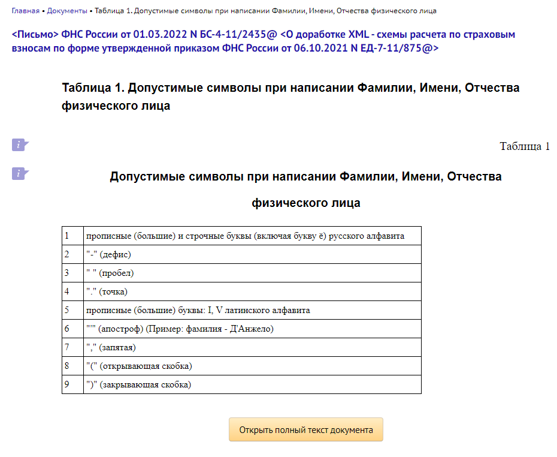

# Задание 5

**Текст задания**
<details>
  <summary>Текст задания находится в этом скрытом блоке</summary>

  5. * Предложите реализацию п.1 и п.2 через питон, какими библиотеками будете пользоваться? Если изначально шли реализацией в питоне, просто укажите библиотеки для считывания и записи в БД.
     * Предложите реализацию разбора поступающих на запись в базу JSON’ов, с выделением ФИО, разбиением ФИО на три блока и обработкой опечаток, ошибок OCR и типовых сокращений (Р0гова ирино Петр-на) 
</details>

**Датасет с ФИО (kaggle - Russian (Cyrillic) full names and gender):** https://www.kaggle.com/datasets/rai220/russian-cyrillic-names-and-sex

Этот датасет может быть скачан, при условии того, что Вы залогинились на kaggle, именно он и есть тот самый data.csv, с чего всё начиналось в файле "/data/fio_data_preprocessing". Залить его на GitHub не получилось, так как он весит больше 100 mb.

<details>
  <summary>Скрин законодательства РФ, согласно которому проводилась предобработка данных</summary>

  
</details>

Регулярное выражение, соответствующее всем перечисленным правилам, может выглядеть так:
```
  [^а-яА-ЯёЁ'-.,IV()\s]
```

Это регулярное выражение можно разбить на части:
* [а-яА-Я] — соответствует всем строчным и прописным буквам русского алфавита.
* ёЁ — соответствует букве «ё».
* ' — соответствует апострофу.
* - — соответствует дефису.
* . — соответствует точке.
* , — соответствует запятой.
* IV — соответствует буквам I и V латинского алфавита.
* \s — соответствует пробелу.
* () — соответствуют открывающей и закрывающей скобкам.

Особенности:
* Данные лежат в папке data в виде файлов .jsonl
* Остальные методы расположены в папке utils: в каждом из соответствующих файлов есть комментарий и описана логика его работы
* Работа основной логики описана в "utils/name_detection.py": работает по принципу поисковой системы с расчетом степени соответствия, релевантности и коэффициента, определяемого эмпирически выведенной константой
* При запуске main.py из командной строки реализован парсинг аргументов, где `--name_to_parse` есть строка с определяемыми ФИО и полом, разделенные точкой с запятой, вида:
  ```
    'Р0гова;ирина;Петр-на;Ж'
    'Кураш0в;маским;михаилович;М'
  ```
* Запуск скрипта может быть проведен следующим образом:
```bash
  python task_5\main.py --name_to_parse 'Р0гова;ирина;Петр-на;Ж'
```

Тестирование:
1. Мальчик:
   Ввод: `python task_5\main.py --name_to_parse 'Кураш0в;маским;михаилович;М'`
   Вывод:
   ```
    {'name': 'КУРАШОВ', 'correspondence_level': 0.8571428571428571, 'relevance': 168, 'coef': 428739.4285714285}
    {'name': 'МАКСИМ', 'correspondence_level': 0.8333333333333334, 'relevance': 47093, 'coef': 463759.6666666667}
    {'name': 'МИХАЙЛОВИЧ', 'correspondence_level': 0.95, 'relevance': 117732, 'coef': 592732.0}
    
    Итоговое ФИО: {'surname': 'КУРАШОВ', 'name': 'МАКСИМ', 'middlename': 'МИХАЙЛОВИЧ', 'gender': 'м'}
   ```
2. Девочка:
   Ввод: `python task_5\main.py --name_to_parse 'Р0гова;ирина;Петр-на;Ж'`
   Вывод:
   ```
    {'name': 'РОГОВА', 'correspondence_level': 0.8333333333333334, 'relevance': 1586, 'coef': 418252.6666666667}
    {'name': 'ИРИНА', 'correspondence_level': 1.0, 'relevance': 138415, 'coef': 638415.0}
    {'name': 'ПЕТРОВНА', 'correspondence_level': 0.625, 'relevance': 94538, 'coef': 407038.0}
    
    Итоговое ФИО: {'surname': 'РОГОВА', 'name': 'ИРИНА', 'middlename': 'ПЕТРОВНА', 'gender': 'ж'}
   ```
